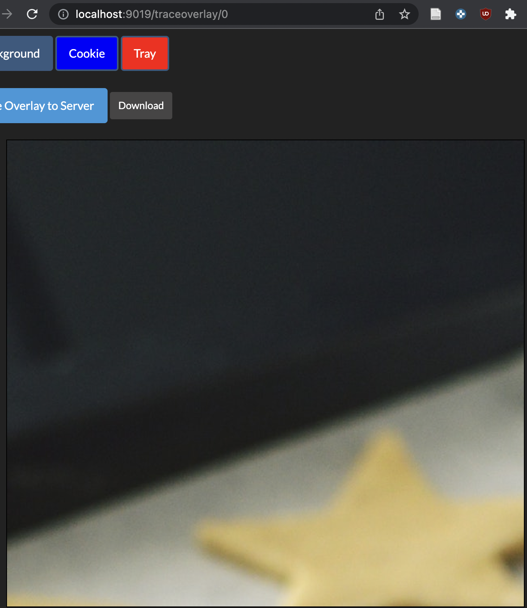
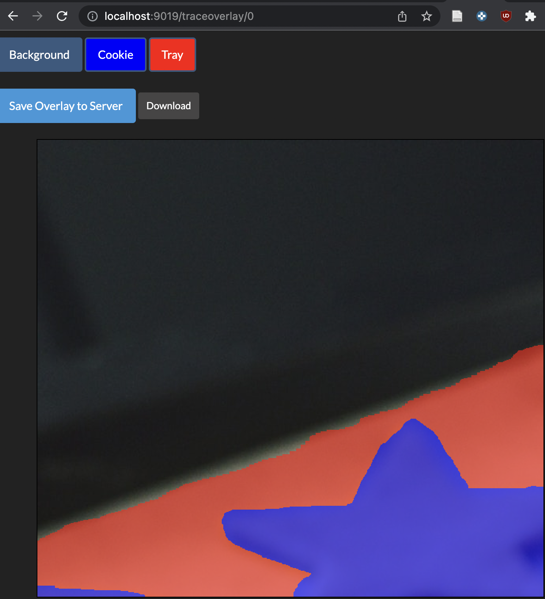

# TraceOverlay

`go get github.com/carbocation/traceoverlay`

## Purpose

TraceOverlay is a tool for labeling pixels within an image with semantically
meaningful labels (semantic segmentation). The tool was written to create
training data for aortic segmentation in the folling manuscript:

> Pirruccello, J.P., Chaffin, M.D., Chou, E.L. *et al*. Deep learning enables genetic analysis of the human thoracic aorta. *Nat Genet* 54, 40–51 (2022). https://doi.org/10.1038/s41588-021-00962-4

## Installation
```sh
cd cmd/traceoverlay
go install
cd ../../
```

## Demos

Demo config files have relative paths that will only work if run from this
folder (the same folder as this README).
### Running the basic demo

```sh
traceoverlay -config demo/basic/config.json
```

Then navigate in your browser to http://localhost:9019

### Running the advanced demo
```sh
traceoverlay -config demo/advanced/config.json
```

Then navigate in your browser to http://localhost:9019

The advanced demo uses a `manifest.tsv` file to specify which images should be
listed (rather than listing all images in a folder).

### Demo image licensing

Note: images are used with permission from the "[Pexels
License](https://www.pexels.com/photo-license/)" from
https://www.pexels.com/photo/christmas-cookies-on-tray-3370704/


## Output
Each traced overlay is output as the input filename with `.mask.png` appended.

## Screenshots




