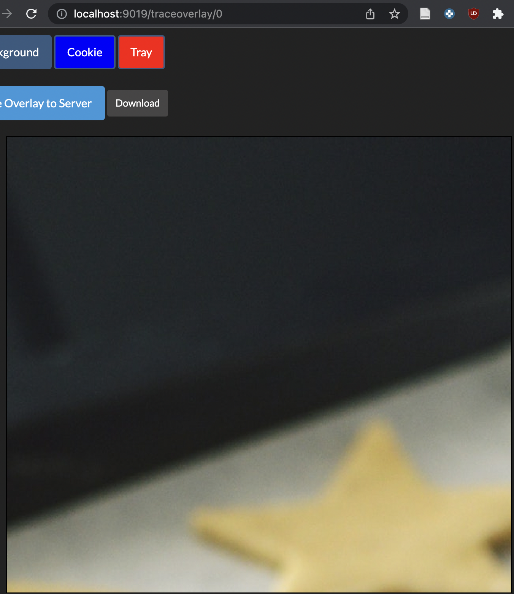
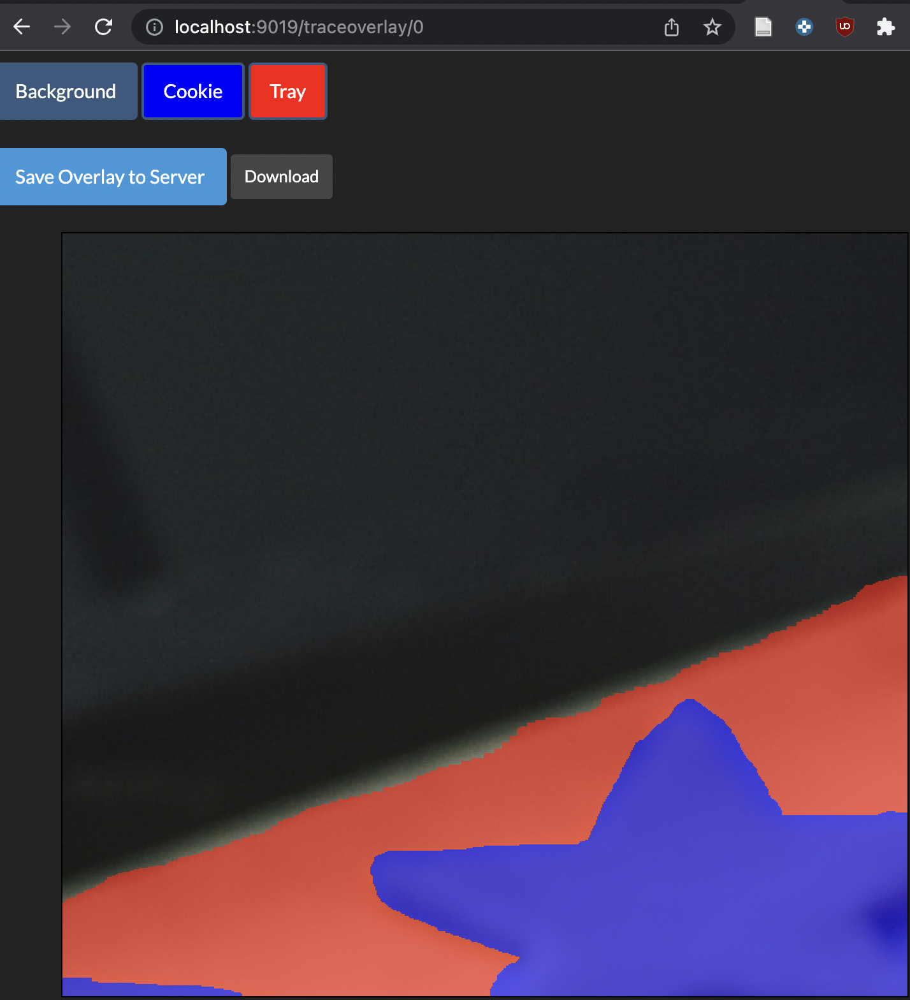

# TraceOverlay

`go get github.com/carbocation/traceoverlay`

## Purpose

TraceOverlay is a tool for labeling pixels within an image with semantically
meaningful labels (semantic segmentation). The tool was written to create
training data for aortic segmentation in the following manuscript:

> Pirruccello, J.P., Chaffin, M.D., Chou, E.L. *et al*. Deep learning enables genetic analysis of the human thoracic aorta. *Nat Genet* 54, 40–51 (2022). https://doi.org/10.1038/s41588-021-00962-4

## Installation
```sh
cd cmd/traceoverlay
go install
cd ../../
```

## Demos

Demo config files have relative paths that will only work if run from this
folder (the same folder as this README).
### Running the basic demo

```sh
traceoverlay -config demo/basic/config.json
```

Then navigate in your browser to http://localhost:9019

### Running the advanced demo
```sh
traceoverlay -config demo/advanced/config.json
```

Then navigate in your browser to http://localhost:9019

The advanced demo uses a `manifest.tsv` file to specify which images should be
listed (rather than listing all images in a folder).

### Demo image licensing

Note: images are used with permission from the "[Pexels
License](https://www.pexels.com/photo-license/)" from
https://www.pexels.com/photo/christmas-cookies-on-tray-3370704/


## AI-assisted annotation with PyTorch models

TraceOverlay can use your own TorchScript (traced) PyTorch models to pre-label images, letting you refine a prediction rather than trace from scratch.

### Setup

```sh
cd inferd
pip install -r requirements.txt
cp models.yaml.example models.yaml
```

Edit `inferd/models.yaml` to point at your `.pt` files. The key fields per model are:

| Field | Description |
|---|---|
| `path` | Path to the TorchScript `.pt` file |
| `device` | `cuda:0`, `cuda:1`, `cpu`, etc. |
| `input_channels` | `1` for grayscale (default), `3` for RGB |
| `input_size` | Model input resolution (images are resized to `input_size × input_size`) |
| `normalize.mean` / `normalize.std` | Per-channel normalization — must match training |
| `output_map` | Optional. See below. |

### Controlling which categories are painted (`output_map`)

By default (no `output_map`), category 0 is treated as background and skipped; category N is painted using the traceoverlay label whose ID equals N.

For iterative-refinement workflows — e.g. you trained a model for a new structure and want to paint only that structure without disturbing existing manual labels — use `output_map`:

```yaml
output_map:
  0: ignore   # background → leave existing annotations untouched
  1: 6        # foreground → paint as traceoverlay label ID 6
```

`ignore` means the pixel is left exactly as it is on the canvas. Any category not listed in `output_map` is also ignored.

### Starting the inference service

```sh
cd inferd
uvicorn server:app --host 0.0.0.0 --port 8081
```

### Running traceoverlay with inference enabled

```sh
traceoverlay -config your_config.json -inference_url http://localhost:8081
```

A **⊹ Predict** button and model dropdown will appear in the annotation UI. Clicking Predict sends the current image to the inference service and merges the result onto the canvas. The action is fully undoable with the existing Undo button.

## Output
Each traced overlay is output as the input filename with `.mask.png` appended.

## Screenshots




